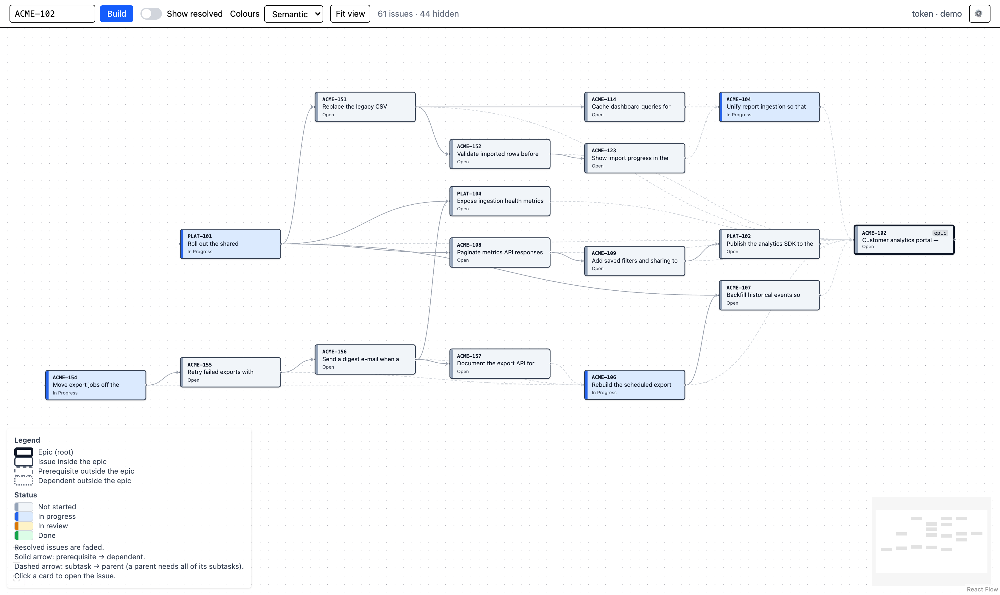

# YouTrack Epic Roadmap

Interactive dependency roadmap for a YouTrack epic. Pure single-page app: no backend,
all authorization happens in the browser.

Live: https://xelon-ua.github.io/youtrack-epic-roadmap/

## What it does

Give it an epic id (e.g. `WMS-985`). It collects every subtask recursively, follows
`Depend` links to prerequisites outside the epic (recursively) and to dependents outside
the epic (one level), and lays the result out in layers: leftmost issues have no
unresolved prerequisites. Hide resolved issues to see what can be started now.

Above: a real epic with "Show resolved" turned off — 17 open issues out of 61. The data is
anonymised, so every issue id, summary and assignee in the picture is made up; the shape of
the graph is not.

## Setup

See [docs/setup-youtrack.md](docs/setup-youtrack.md): a YouTrack admin must allow the
app origin (CORS) and register an OAuth client in Hub. Without OAuth you can paste a
permanent token in Settings.

## Development

    npm install
    npm run dev        # http://localhost:5173/youtrack-epic-roadmap/
    npm test           # vitest
    npm run build

Architecture notes: [docs/architecture.md](docs/architecture.md).
